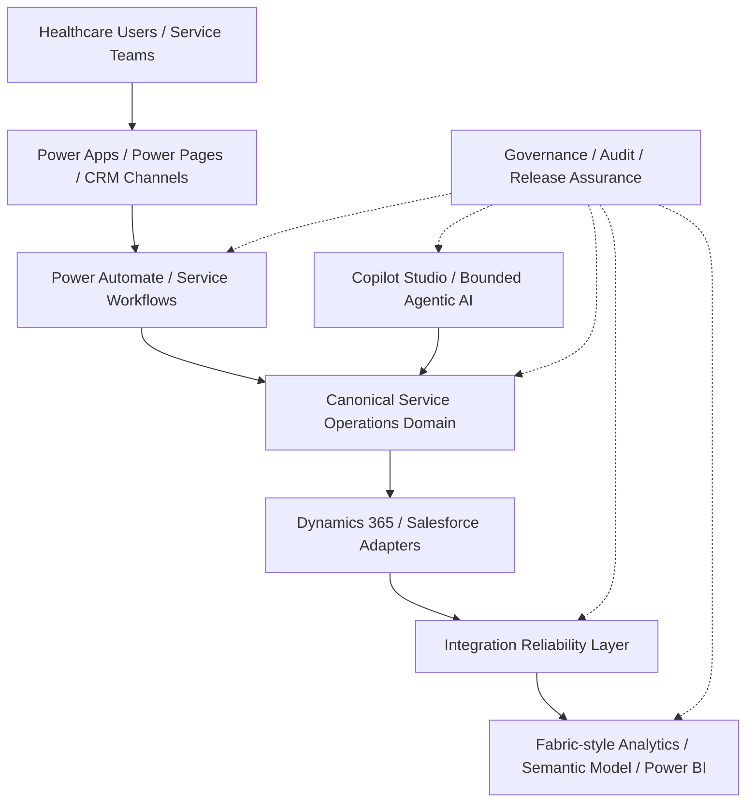

# Healthcare Agentic Service Operations Platform

Synthetic enterprise healthcare service-operations reference platform showing how
canonical service management, CRM adapters, Power Platform automation, Copilot
Studio-style experiences, bounded agentic AI, integration reliability, Fabric-style
analytics, governance, and release assurance can fit together without burying
business rules inside SaaS tools or generated text.

This is a portfolio/reference implementation. It uses fictional healthcare
service-operation data only. It is not connected to the NHS or any real healthcare
provider, and it does not run against live Dynamics 365, Salesforce, Power Platform,
Copilot Studio, Azure OpenAI, Microsoft Fabric, or Power BI environments.

## What It Demonstrates

The repository models a fictional healthcare provider service desk handling:

- digital support
- facilities requests
- clinical-equipment servicing
- identity and access requests
- application support
- data and reporting requests

It addresses common service-operation problems: fragmented CRM processes, manual
routing, inconsistent SLA handling, weak escalation evidence, unclear AI
accountability, integration retries/duplicates, analytics lineage, and release
governance.

## Reference Implementation Includes

- canonical healthcare service operations in [`business_process/`](business_process/)
- Dynamics 365 Customer Service reference adapter in [`dynamics365/`](dynamics365/)
- Salesforce Service Cloud reference adapter in [`salesforce/`](salesforce/)
- Power Automate workflow specs, Power Apps/Power Pages architecture, and connector
  contracts in [`power_platform/`](power_platform/)
- Copilot Studio reference topics in [`copilot/`](copilot/)
- bounded agentic AI, deterministic knowledge retrieval, prompt metadata, safety
  checks, and evaluation in [`ai/`](ai/)
- integration envelope, webhook processing, idempotency, retry, reconciliation, and
  observability in [`integrations/`](integrations/)
- Fabric-style Bronze/Silver/Gold analytics, semantic model metadata, and Power BI
  report specification in [`analytics/`](analytics/)
- governance controls, policy checks, audit evidence, attestations, release
  assurance, and CI evidence checks in [`governance/`](governance/)
- deterministic synthetic evidence under [`data/synthetic/`](data/synthetic/) and
  selected tracked reports under [`reports/`](reports/)

## Reference-Only Boundaries

The repository intentionally does **not** include:

- live CRM, Power Platform, Copilot Studio, Fabric, or Power BI tenant connections
- production OAuth/token exchange, secrets, certificates, tenant IDs, or endpoints
- deployed Power Automate solutions, `.msapp` files, portal assets, `.pbix` files, or
  screenshots
- live LLM calls, autonomous case mutation, or clinical diagnosis/treatment content
- production IAM, SIEM, secrets manager, immutable enterprise audit store, live
  monitoring, or support commitments
- regulatory certification, security certification, or real NHS delivery claims

Real-world deployment would additionally require licensed SaaS/cloud environments,
identity and secrets management, live connectors/endpoints, environment-specific
security configuration, monitoring, organisational approvals, operational support,
and deployment validation.

## Architecture



Core architecture rule: deterministic business decisions live in
[`business_process/`](business_process/). CRM adapters translate. Power Platform
orchestrates. AI recommends or summarizes within guardrails. Integrations move,
retry, correlate, and observe messages. Analytics is downstream. Governance reviews
and assures the reference implementation.

## How To Review This Repository

1. Architecture: [`docs/architecture.md`](docs/architecture.md)
2. Canonical service model: [`business_process/`](business_process/),
   [`docs/business_process.md`](docs/business_process.md)
3. CRM mappings: [`dynamics365/`](dynamics365/), [`salesforce/`](salesforce/),
   [`docs/crm_schema_mapping.md`](docs/crm_schema_mapping.md)
4. Power Platform automation: [`power_platform/`](power_platform/)
5. Copilot and bounded agents: [`copilot/`](copilot/), [`ai/`](ai/)
6. Analytics and Power BI design: [`analytics/`](analytics/)
7. Integration reliability: [`integrations/`](integrations/)
8. Governance and assurance: [`governance/`](governance/),
   [`docs/governance.md`](docs/governance.md)
9. Evidence index: [`docs/evidence-index.md`](docs/evidence-index.md)
10. Architecture decisions: [`docs/architecture-decisions.md`](docs/architecture-decisions.md)

## Capability Matrix

| Capability | Status | Key Location | Evidence |
|---|---|---|---|
| Service operations domain | Implemented | [`business_process/`](business_process/) | [`reports/case_summary.json`](reports/case_summary.json) |
| Dynamics 365 mapping | Implemented reference adapter | [`dynamics365/`](dynamics365/) | [`data/synthetic/dynamics365_examples.json`](data/synthetic/dynamics365_examples.json) |
| Salesforce mapping | Implemented reference adapter | [`salesforce/`](salesforce/) | [`data/synthetic/salesforce_examples.json`](data/synthetic/salesforce_examples.json) |
| Power Platform workflows | Implemented specs | [`power_platform/power_automate/`](power_platform/power_automate/) | [`reports/automation_summary.json`](reports/automation_summary.json) |
| Power Apps / Power Pages | Reference architecture | [`power_platform/power_apps/`](power_platform/power_apps/), [`power_platform/power_pages/`](power_platform/power_pages/) | [`power_platform/README.md`](power_platform/README.md) |
| Copilot Studio | Reference topics | [`copilot/copilot_studio/`](copilot/copilot_studio/) | [`data/synthetic/copilot_conversations.json`](data/synthetic/copilot_conversations.json) |
| Bounded agents | Implemented deterministic layer | [`ai/`](ai/) | [`data/synthetic/agent_tool_traces.json`](data/synthetic/agent_tool_traces.json) |
| Knowledge retrieval and AI evaluation | Implemented deterministic layer | [`ai/knowledge.py`](ai/knowledge.py), [`ai/evaluation.py`](ai/evaluation.py) | [`reports/agentic_ai_evaluation_summary.json`](reports/agentic_ai_evaluation_summary.json) |
| Integration transport / retry | Implemented local reference layer | [`integrations/`](integrations/) | [`reports/integration_operations_summary.json`](reports/integration_operations_summary.json) |
| Reconciliation | Implemented deterministic checks | [`integrations/reconciliation.py`](integrations/reconciliation.py) | [`reports/reconciliation_report.md`](reports/reconciliation_report.md) |
| Analytics | Implemented Fabric-style transforms | [`analytics/fabric/`](analytics/fabric/) | [`reports/analytics_summary.json`](reports/analytics_summary.json) |
| Semantic model / Power BI | Reference metadata/spec | [`analytics/semantic_model/`](analytics/semantic_model/), [`analytics/powerbi/`](analytics/powerbi/) | [`reports/service_operations_report.md`](reports/service_operations_report.md) |
| Governance controls | Implemented reference controls | [`governance/`](governance/) | [`reports/governance_summary.json`](reports/governance_summary.json) |
| Release assurance | Implemented reference checks | [`governance/release.py`](governance/release.py) | [`reports/release_assurance.json`](reports/release_assurance.json) |

## What This Supports In An Interview

The project is designed to support technical discussion of:

- business-process modelling and canonical domain boundaries
- Dynamics 365 and Salesforce CRM architecture tradeoffs
- Power Platform orchestration without duplicating business rules
- Copilot Studio and bounded agentic AI with human-in-the-loop controls
- deterministic AI evaluation, knowledge grounding, and tool allow-listing
- integration reliability: envelopes, idempotency, retry, dead-letter, reconciliation
- Fabric/Power BI-style analytics, semantic modelling, and metric lineage
- governance, audit evidence, policy evaluation, and release assurance
- CI/CD quality gates and evidence reproducibility

## Repository Structure

```text
business_process/     Canonical service operations model
dynamics365/          Dynamics 365 / Dataverse reference adapter
salesforce/           Salesforce Service Cloud reference adapter
power_platform/       Power Automate, Power Apps, Power Pages, connector specs
copilot/              Copilot Studio topic and prompt reference design
ai/                   Bounded agents, tools, knowledge, safety, evaluation
integrations/         Envelope, webhook processing, retry, reconciliation, evidence
analytics/            Fabric-style transformations, semantic model, Power BI spec
governance/           Controls, policies, audit evidence, attestations, assurance
data/synthetic/       Deterministic synthetic data and trace evidence
reports/              Selected generated portfolio evidence
docs/                 Architecture, governance, roadmap, evidence index
tests/                Automated quality and boundary tests
```

## Quality Gates

The repository is configured for:

```text
python3 -m ruff check .
python3 -m ruff format --check .
python3 -m mypy business_process dynamics365 salesforce integrations power_platform ai copilot analytics governance
python3 -m pytest --cov
python3 -m governance.policies
```

GitHub Actions runs linting, formatting, type checking, tests with coverage,
governance policy checks, and deterministic assurance-evidence verification.

## Delivery Roadmap

Milestones 1-8 are complete as a reference implementation. Milestone 9 is final
portfolio polish and reviewer experience.

| Milestone | Scope | Status |
|---|---|---|
| 1 | Foundation | Done |
| 2 | Canonical service operations | Done |
| 3 | Dynamics 365 and Salesforce CRM adapter architecture | Done |
| 4 | Power Platform automation architecture | Done |
| 5 | Copilot Studio and bounded agentic AI | Done |
| 6 | Fabric-style analytics and operational intelligence | Done |
| 7 | Integration transport, reliability, and observability | Done |
| 8 | Governance and release assurance | Done |
| 9 | Final portfolio polish and reviewer experience | This pass |

Future live-deployment extensions are deliberately outside this reference scope:
live Dataverse/Salesforce/Power Platform/Copilot/Fabric environments, production
identity and secrets management, real endpoints, live monitoring, operational
support, and organisation-specific security approvals.

## Evidence

Start with [`docs/evidence-index.md`](docs/evidence-index.md). It points to the
strongest generated artefacts and explains what each demonstrates without
duplicating the artefacts themselves.

## Portfolio Scope

This repository is an independent portfolio project. It is not affiliated with,
endorsed by, or built for the NHS or any healthcare organisation. It processes no
real patient, clinical, staff, tenant, or operational data. All evidence is
synthetic and deterministic.
