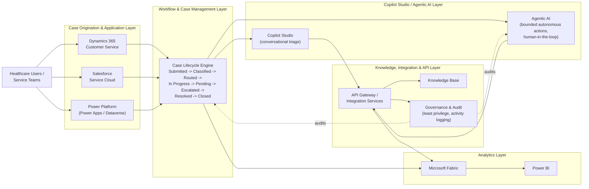

# Healthcare Agentic Service Operations Platform

> **Portfolio project.** A synthetic, architecture-first demonstration of enterprise
> business solution design for healthcare-style service operations. It is **not**
> connected to any real NHS system, does not process real patient data, and does not
> run against a live Dynamics 365, Salesforce, Power Platform, Copilot Studio,
> Fabric, or Power BI tenant/workspace. See the
> [Portfolio & Simulation Disclaimer](#10-portfolio--simulation-disclaimer) below.

**Status:** Milestone 6 — Fabric Analytics and Operational Intelligence
(see [§9](#9-current-implementation-status)).

---

## Table of Contents

1. [Business Problem](#1-business-problem)
2. [Synthetic Healthcare Scenario](#2-synthetic-healthcare-scenario)
3. [Target Capabilities](#3-target-capabilities)
4. [High-Level Solution Architecture](#4-high-level-solution-architecture)
5. [Technology Landscape](#5-technology-landscape)
6. [Repository Structure](#6-repository-structure)
7. [Delivery Roadmap](#7-delivery-roadmap)
8. [Governance & Responsible AI Principles](#8-governance--responsible-ai-principles)
9. [Current Implementation Status](#9-current-implementation-status)
10. [Portfolio & Simulation Disclaimer](#10-portfolio--simulation-disclaimer)

---

## 1. Business Problem

Large healthcare provider organisations run internal service operations — digital
support, clinical equipment logistics, facilities requests, access and identity
management, application support, and data/reporting requests — across a mix of
case-management platforms (e.g. Dynamics 365 Customer Service, Salesforce Service
Cloud), low-code automation (Power Platform), and, increasingly, conversational and
agentic AI (Copilot Studio, autonomous agents).

This creates recurring architectural challenges:

- **Platform fragmentation** — service teams and case data are split across CRM
  platforms with inconsistent process models.
- **Inconsistent case handling** — classification, routing, and escalation logic is
  often duplicated or platform-specific rather than defined once as a business
  process.
- **Unclear AI accountability** — as agentic AI is introduced into service
  operations, organisations need a clear model of what is deterministic automation
  versus autonomous agent behaviour, and where a human must stay in the loop.
- **Weak evidence trails** — audit, governance, and reporting are frequently
  bolted on rather than designed in from the start.
- **Vendor lock-in risk** — business logic embedded directly in a single SaaS
  platform is expensive to port or replace.

This repository demonstrates how these problems can be addressed through
platform-neutral business process design, API-first integration, and governed
agentic AI — using a synthetic healthcare scenario as the worked example.

## 2. Synthetic Healthcare Scenario

All scenario content in this repository is **fictional and synthetic**, styled on
an NHS-like service operations context for realism, but containing no real
organisational, patient, or operational data.

The scenario: a fictional healthcare provider trust runs an internal service desk
that handles requests from clinical and non-clinical staff across six synthetic
service categories:

- **Digital Support** — laptops, accounts, collaboration tools
- **Clinical Equipment** — requests, faults, and logistics for non-patient-identifying
  clinical equipment
- **Facilities** — estates, environment, and physical workplace requests
- **Access and Identity** — role-based access requests, joiners/movers/leavers
- **Application Support** — line-of-business application incidents and requests
- **Data and Reporting** — internal reporting and analytics requests

Every request (a "case") conceptually moves through the same lifecycle regardless of
which platform originates or handles it:

```
Submitted → Classified → Routed → In Progress → Pending → Escalated → Resolved → Closed
```

This lifecycle and taxonomy are defined once, platform-neutrally, in
[`business_process/`](business_process/), so that Dynamics 365, Salesforce, and any
future channel implement the *same* business process rather than inventing their own.
Each case also carries a priority, a configurable SLA target, deterministic
queue/owner routing, an audit trail, and a resolution outcome — see
[`docs/business_process.md`](docs/business_process.md) for the full model,
including the case lifecycle and routing diagrams. [`dynamics365/`](dynamics365/)
and [`salesforce/`](salesforce/) now translate this same canonical case into
each CRM's own concepts — see [`docs/crm_schema_mapping.md`](docs/crm_schema_mapping.md).

## 3. Target Capabilities

The platform is designed (across all milestones, not all built yet — see
[§7](#7-delivery-roadmap)) to demonstrate:

- A platform-neutral case/service-request process model and taxonomy
- Reference case-management patterns on **Dynamics 365 Customer Service** and
  **Salesforce Service Cloud** as interchangeable, bounded application contexts
- **Power Platform** automation patterns (Power Automate flow design, Dataverse
  modelling) for deterministic workflow steps
- **Copilot Studio** and agentic AI patterns for triage, knowledge assistance, and
  bounded autonomous actions, with explicit human-in-the-loop checkpoints
- **API-first integration** between case-management systems, automation, and AI
  agents, avoiding direct point-to-point coupling
- **Fabric / Power BI** analytics over synthetic case data for operational
  reporting and evidence
- **Governance tooling** — audit logging patterns, least-privilege access design,
  and responsible-AI guardrails
- **CI/CD and engineering baseline** — linting, static analysis, and automated
  tests supporting the above as real, runnable code (not just diagrams)

## 4. High-Level Solution Architecture



**Reading the diagram:** healthcare users interact with case-management platforms
(Dynamics 365, Salesforce, Power Platform), which all feed a single, platform-neutral
case lifecycle. Copilot Studio and agentic AI sit alongside that lifecycle — never
replacing it — and reach the rest of the estate only through an API/integration
layer, which is also where governance and audit controls are enforced. Analytics
(Fabric / Power BI) consumes case and integration data for reporting, independent of
which front-end CRM originated the case.

See [`docs/architecture.md`](docs/architecture.md) for the full set of architecture
principles and their rationale.

## 5. Technology Landscape

| Layer                     | Representative Technology                          | Role in this repository |
|---------------------------|------------------------------------------------------|----------------------------------------|
| CRM / Case Management     | Dynamics 365 Customer Service, Salesforce Service Cloud | **Implemented as reference adapters** — deterministic translation only; no SDK, no live tenant |
| Low-code Automation       | Power Platform (Power Apps, Power Automate, Dataverse) | **Implemented as reference architecture/specifications** — no live tenant, deployed flows, or connector |
| Conversational / Agentic AI | Copilot Studio, agentic AI patterns                 | **Implemented as reference architecture/specifications** — deterministic local simulation only; no live LLM or tenant |
| Integration                | API-first services, event/message patterns          | **Partially implemented** — `IntegrationEnvelope` contract + deterministic example generator; no transport/broker yet |
| Analytics                  | Microsoft Fabric, Power BI                           | **Implemented as reference analytics** — local deterministic transforms, semantic/report specs; no live Fabric or Power BI deployment |
| Business Process           | Platform-neutral Python domain model                | **Implemented** — taxonomy, lifecycle rules, priority, queues/routing, SLA, escalation, audit trail, synthetic fixtures |
| Governance                 | Audit/access design patterns                         | **Partially documented** — Power Platform control intent added; no operating governance tooling |
| Engineering Baseline       | Python 3.11+, pytest, ruff, mypy, Docker, GitHub Actions | **Implemented** |

Dependencies are kept deliberately minimal for the implemented milestones — see
[`requirements.txt`](requirements.txt) and [`pyproject.toml`](pyproject.toml).
Platform-specific SDKs are intentionally **not** installed until a milestone
actually implements against them, to avoid implying integrations that do not
exist yet.

## 6. Repository Structure

```
healthcare-agentic-service-operations-platform/
├── business_process/     # Canonical service operations model (case, lifecycle, SLA, routing) — implemented
├── dynamics365/           # Dynamics 365 / Dataverse reference adapter — implemented (deterministic, no SDK)
├── salesforce/            # Salesforce Service Cloud reference adapter — implemented (deterministic, no SDK)
├── power_platform/        # Power Platform automation/app/portal/connector reference architecture — implemented (specifications only)
├── copilot/                # Copilot Studio topic/prompt reference architecture — implemented (specifications only)
├── ai/                      # Bounded agentic-AI layer, tool registry, knowledge, triage, evaluation — implemented (deterministic)
├── analytics/              # Fabric-style analytics, semantic model, Power BI report specs — implemented (deterministic)
├── integrations/           # IntegrationEnvelope contract + example generator — partially implemented
├── governance/             # Audit, access, and responsible-AI controls — placeholder + documented controls
├── data/                    # Synthetic data only — generated fixtures/config (data/synthetic/)
├── outputs/                 # Generated artefacts (git-ignored contents)
├── reports/                 # Generated reports (selected evidence tracked; rest git-ignored)
├── docs/                    # Extended architecture, business process, CRM schema mapping, governance, and roadmap docs
├── tests/                   # Automated tests
├── .github/workflows/       # CI pipeline
├── Dockerfile
├── pyproject.toml
├── requirements.txt
└── README.md
```

Each still-placeholder domain contains a short `README.md` explaining its
intended scope and current (unimplemented) status — no fabricated
connectors, credentials, or SaaS assets are included anywhere in the
repository, implemented or not.

## 7. Delivery Roadmap

| Milestone | Scope | Status |
|-----------|-------|--------|
| 1 | Repository foundation: architecture, structure, engineering baseline, CI | Done |
| 2 | Platform-neutral business process implementation (case model, lifecycle rules, priority, queues/routing, SLA, escalation, audit trail, synthetic fixtures) | Done |
| 3 | Dynamics 365 and Salesforce CRM adapter architecture (deterministic reference mappings, schema documentation, integration envelope) | Done |
| 4 | Power Platform automation architecture (Power Automate specs, Power Apps/Power Pages architecture, connector contracts, approval/evidence patterns) | Done |
| 5 | Copilot Studio & bounded agentic AI patterns with human-in-the-loop controls | Done |
| 6 | Fabric analytics and operational intelligence over generated synthetic evidence | **This milestone** |
| 7 | Live integration transport (API client/message mechanism around the Milestone 3 `IntegrationEnvelope` contract) | Planned |
| 8 | Governance, audit trail, and responsible-AI controls hardening | Planned |

Milestone scope, sequencing, and detail may evolve as the portfolio project
progresses. See [`docs/roadmap.md`](docs/roadmap.md) for more detail.

## 8. Governance & Responsible AI Principles

These principles apply across every milestone of this repository:

- **Platform-neutral business-process design** — the case lifecycle and taxonomy are
  defined independently of any single CRM/SaaS platform.
- **Dynamics 365 and Salesforce as bounded application contexts** — each platform is
  treated as a replaceable implementation detail, not the source of truth for
  business process.
- **API-first integration** — systems integrate through defined APIs/contracts, not
  direct database or UI-layer coupling.
- **Loose coupling** — components are designed to be replaced independently.
- **Human-in-the-loop controls** — any agentic AI action with real-world effect has
  a defined human checkpoint.
- **Deterministic automation vs. autonomous agent behaviour** — Power Automate-style
  deterministic workflow steps are explicitly distinguished from agentic AI
  decisions in design and documentation.
- **Least privilege** — every integration and agent is designed against the minimum
  access it needs, not broad/admin access.
- **Auditable agent activity** — agentic AI actions are designed to be logged and
  reviewable, not opaque.
- **Synthetic data only** — no real patient, staff, or organisational data is used
  anywhere in this repository.
- **Portable analytics/evidence** — analytics and reporting artefacts are designed to
  be exportable and platform-independent, not locked to one BI tool.
- **Modular, replaceable SaaS components** — every platform-specific area is
  designed so it could be swapped for an equivalent product without changing the
  core business process.

See [`docs/governance.md`](docs/governance.md) for extended rationale.

## 9. Current Implementation Status

**Implemented (Milestone 1 — Repository Foundation):**

- ✅ Repository structure and bounded-context placeholders for every target domain
- ✅ Engineering baseline: `pyproject.toml`, `requirements.txt`, `.gitignore`,
  `Dockerfile`, GitHub Actions CI (lint, type-check, test)

**Implemented (Milestone 2 — Business Process Modelling & Platform-Neutral
Service Operations Model):**

- ✅ Platform-neutral service taxonomy and case lifecycle, with **explicit,
  enforced transition rules** (`business_process/lifecycle.py`) — invalid
  moves are rejected deterministically, not silently accepted
- ✅ Case priority (`Priority`), deterministic queue/routing model
  (`queues.py`), and case ownership by team
- ✅ A simple, configurable SLA model (`sla.py`) — response/resolution
  targets by priority and category, with breach evaluation
- ✅ Deterministic escalation triggers (`escalation.py`) — SLA breach or
  critical-priority-pending, not an AI/agent decision
- ✅ The canonical `Case`/`CaseEvent` aggregate (`models.py`) with a full
  audit trail and resolution outcomes
- ✅ JSON-safe serialization and six deterministic synthetic case fixtures
  spanning every service category (`fixtures.py`), generated into
  [`data/synthetic/`](data/synthetic/) and [`reports/`](reports/) by
  [`business_process/evidence.py`](business_process/evidence.py)
- ✅ [`docs/business_process.md`](docs/business_process.md) (service
  operating model, lifecycle diagram, routing diagram, SLA model, escalation
  model, roles/responsibilities, and the canonical-domain-vs-platform-adapter
  boundary)

**Implemented (Milestone 3 — Dynamics 365 and Salesforce
CRM Adapter Architecture):**

- ✅ Canonical service operations model — unchanged, still the single
  source of truth (see above)
- ✅ Deterministic Dynamics 365 / Dataverse reference adapter
  ([`dynamics365/`](dynamics365/)) — typed models, explicit mapping
  tables, pure `to_dynamics_incident()`/`to_dynamics_timeline()`
  translation, and safe reverse mappings (priority, stage, queue) with
  `UnsupportedDynamicsValueError` for unmapped values. No SDK, no live
  tenant, no credentials.
- ✅ Deterministic Salesforce Service Cloud reference adapter
  ([`salesforce/`](salesforce/)) — the same pattern: typed models, explicit
  mapping tables, pure `to_salesforce_case()`/`to_salesforce_feed()`
  translation, safe reverse mappings, `UnsupportedSalesforceValueError`.
  No SDK/API client, no live org, no credentials.
- ✅ Every non-1:1 mapping documented, not glossed over — see
  [`docs/crm_schema_mapping.md`](docs/crm_schema_mapping.md) (e.g. Dynamics
  collapsing `RESOLVED`/`CLOSED` onto one native state; both platforms'
  out-of-the-box 3-value priority picklists needing a documented 4-value
  extension to avoid lossy collapse).
- ✅ Lightweight `IntegrationEnvelope` contract and a deterministic
  cross-CRM example generator ([`integrations/`](integrations/)) — source
  system, source record id, canonical case id, correlation id, schema
  version, timestamp, operation. No message broker or transport.
- ✅ **Enforced architecture boundary**: neither adapter imports a
  `business_process` decision function (`validate_transition`,
  `should_escalate`, `evaluate_sla`, `route_category`, ...) —
  `tests/test_adapter_boundary.py` checks this via source-code inspection,
  not just convention.
- ✅ Deterministic synthetic examples for all 6 fixture cases in both CRM
  representations, tracked at
  [`data/synthetic/dynamics365_examples.json`](data/synthetic/dynamics365_examples.json)
  and [`data/synthetic/salesforce_examples.json`](data/synthetic/salesforce_examples.json)
- ✅ Fixed a Milestone 2 evidence-tracking gap: `reports/case_summary.json`
  is now explicitly un-ignored (narrow `.gitignore` exception) rather than
  silently excluded — see [`reports/README.md`](reports/README.md)
- ✅ Comprehensive automated tests (canonical↔Dynamics mapping,
  canonical↔Salesforce mapping, enum/status/priority conversion,
  unsupported values, deterministic identifiers, canonical case identity
  preservation, and the no-reimplementation boundary)

**Implemented (Milestone 4 — Power Platform Automation
Architecture):**

- ✅ Version-controlled Power Automate reference workflow specifications
  under [`power_platform/power_automate/`](power_platform/power_automate/):
  new service request intake, SLA monitoring/escalation, human approval for
  a consequential non-clinical action, and resolution/closure notification.
  These are deterministic JSON specifications generated from
  [`power_platform/flows.py`](power_platform/flows.py), not exported
  Power Automate solutions or live tenant artefacts.
- ✅ Power Apps reference service-operations application architecture in
  [`power_platform/power_apps/`](power_platform/power_apps/): submission,
  my requests, operations queue, case detail, SLA status, escalation/approval,
  and resolution/feedback views with role and data-boundary constraints.
- ✅ Power Pages self-service portal architecture in
  [`power_platform/power_pages/`](power_platform/power_pages/): authenticated
  request submission, own-request tracking, permitted status visibility,
  knowledge/self-service entry point, and feedback, without unrestricted case
  data exposure.
- ✅ Connector/API boundary contract in
  [`power_platform/connectors/`](power_platform/connectors/) for representative
  operations including `create_case`, `get_case`, `transition_case`,
  `evaluate_sla`, `evaluate_escalation`, `resolve_case`,
  `list_service_categories`, `retrieve_queue_assignment`, and
  `sync_dynamics_representation`. No real custom connector, endpoint, secret,
  or Dataverse plugin is built.
- ✅ Human-in-the-loop approval model
  ([`power_platform/approvals.py`](power_platform/approvals.py)) carrying
  requester, approver role, decision, reason, timestamps, correlation id,
  audit result, and timeout outcome. It deliberately models elevated access,
  not clinical treatment approval.
- ✅ Deterministic synthetic automation evidence:
  [`data/synthetic/power_platform_approval_examples.json`](data/synthetic/power_platform_approval_examples.json),
  [`data/synthetic/power_platform_execution_trace.json`](data/synthetic/power_platform_execution_trace.json),
  and [`reports/automation_summary.json`](reports/automation_summary.json).
  The execution trace is explicitly labelled as simulated reference evidence,
  not live Power Automate run history.
- ✅ Architecture-boundary tests proving workflow specs and connector
  contracts reference real canonical operations and do not redefine lifecycle
  tables, routing rules, SLA formulae, or escalation logic. Existing Dynamics
  365 and Salesforce adapter boundary tests remain intact.

**Implemented (Milestone 5 — Copilot Studio and Bounded
Agentic AI):**

- ✅ Copilot Studio reference architecture under
  [`copilot/copilot_studio/`](copilot/copilot_studio/) with structured topic
  specs for digital, facilities, clinical-equipment service, access, status,
  knowledge, SLA explanation, escalation request, and resolution feedback
  conversations. These are not exported Copilot Studio solutions or deployed
  topics.
- ✅ Bounded agent definitions in [`ai/agents.py`](ai/agents.py): Intake Agent,
  Knowledge Agent, Triage Agent, Case Summary Agent, and Service Operations
  Coordinator, each with narrow tools, prohibited actions, handoff conditions,
  uncertainty handling, and human-review triggers.
- ✅ Explicit allow-listed tool registry in [`ai/tools.py`](ai/tools.py) mapping
  approved AI tools to existing connector/canonical concepts, with risk classes
  and approval gates for state-changing/consequential tools.
- ✅ Deterministic knowledge retrieval in [`ai/knowledge.py`](ai/knowledge.py)
  over a small synthetic operational-support corpus. No clinical
  diagnosis/treatment content, no vector database, and no live enterprise
  knowledge connector.
- ✅ Deterministic AI-triage reference interface in [`ai/triage.py`](ai/triage.py)
  producing suggested category, priority, queue, rationale, confidence, and
  uncertainty indicators. It is explicitly a recommendation; canonical
  validation and routing remain authoritative.
- ✅ Prompt/version governance in [`ai/prompts.py`](ai/prompts.py) and
  [`copilot/prompts/`](copilot/prompts/) for triage, summarisation, knowledge
  answering, tool selection, and escalation explanation. Prompts do not hide
  lifecycle, routing, SLA, escalation, or approval rules.
- ✅ Safety controls in [`ai/safety.py`](ai/safety.py): grounded-response
  posture, clinical-content refusal, secret/credential refusal, unsupported
  action refusal, human-review escalation, and prompt/tool allow-listing.
- ✅ Deterministic evaluation harness in [`ai/evaluation.py`](ai/evaluation.py)
  covering intent recognition, category/priority recommendation, grounded
  knowledge answer, case-summary completeness, unsafe/unsupported request
  refusal, invalid tool prevention, approval requirement, and canonical-rule
  enforcement.
- ✅ Synthetic/reference evidence:
  [`data/synthetic/copilot_conversations.json`](data/synthetic/copilot_conversations.json),
  [`data/synthetic/agent_tool_traces.json`](data/synthetic/agent_tool_traces.json),
  [`data/synthetic/ai_evaluation_cases.json`](data/synthetic/ai_evaluation_cases.json),
  [`data/synthetic/service_knowledge_corpus.json`](data/synthetic/service_knowledge_corpus.json),
  and [`reports/agentic_ai_evaluation_summary.json`](reports/agentic_ai_evaluation_summary.json).
  These are not live Copilot Studio telemetry.

**Implemented (Milestone 6 — this milestone — Fabric Analytics and
Operational Intelligence):**

- ✅ Fabric-style analytical transformation layer under
  [`analytics/fabric/`](analytics/fabric/) with Bronze ingestion over existing
  generated evidence, Silver conformed operational entities, Gold KPI outputs,
  and lightweight data-quality checks. No Spark, Fabric SDK, Lakehouse, or
  Warehouse dependency is introduced.
- ✅ Operational KPI generation covering case volume, category/priority/status
  distribution, open/resolved cases, mean/median resolution time where evidence
  supports it, SLA compliance and breach counts, escalation rate, queue
  workload, resolution outcomes, automation execution counts, approval
  workload, agent/tool invocation counts, and tool-risk mix.
- ✅ Reference semantic model metadata under
  [`analytics/semantic_model/`](analytics/semantic_model/) with dimensions,
  facts, grains, relationships, measures, filter direction assumptions, and
  slowly changing attribute handling notes.
- ✅ Reference Power BI report design under
  [`analytics/powerbi/`](analytics/powerbi/) covering Executive Service
  Overview, Operational Queue Performance, SLA and Escalation, Automation
  Performance, and Agentic AI Assurance pages. No `.pbix`, screenshots, or
  deployed reports are fabricated.
- ✅ Deterministic analytics evidence:
  [`reports/analytics_summary.json`](reports/analytics_summary.json),
  [`reports/service_operations_report.md`](reports/service_operations_report.md),
  and reproducible CSV exports under `outputs/` (`case_metrics.csv`,
  `sla_summary.csv`, `automation_metrics.csv`, `copilot_usage.csv`).
  These are synthetic/generated portfolio artefacts, not production telemetry.
- ✅ Analytics boundary tests and data-quality tests proving the analytics layer
  consumes canonical/CRM/automation/agent evidence downstream without becoming
  a transactional source of truth or redefining operational rules.

**Not yet implemented (later milestones):**

- ❌ No live Dataverse integration (SDK, authentication, or a connected app)
- ❌ No live Salesforce integration (SDK/API client, authentication, or a connected app)
- ❌ No webhooks, in either direction
- ❌ No deployed Power Automate flows, `.zip` solution exports, `.msapp` files,
  live Power Apps apps, live Power Pages site, production custom connector, or
  live Dataverse API calls
- ❌ No live Copilot Studio tenant, exported/deployed Copilot solution, or
  production topic deployment
- ❌ No Azure OpenAI, Azure AI Foundry, external LLM, production LLM deployment,
  or live model inference
- ❌ No autonomous case mutation — AI recommendations and tool plans cannot
  bypass canonical validation or human approval gates
- ❌ No live enterprise knowledge connectors
- ❌ No production AI telemetry
- ❌ No message broker, event platform, or live transport for `IntegrationEnvelope`
- ❌ No live Fabric workspace, Lakehouse/Warehouse deployment, Spark job,
  deployed semantic model, deployed Power BI report, live CRM telemetry
  ingestion, production monitoring, or production deployment
- ❌ No persistence layer, workflow engine, or scheduler — `business_process/`
  models the business rules only, not a running system
- ❌ No deployment of any kind, and no production readiness claimed anywhere

## 10. Portfolio & Simulation Disclaimer

This repository is an **independent portfolio project** built to demonstrate
enterprise business solution architecture skills. It is **not**:

- affiliated with, endorsed by, or built for the NHS or any NHS organisation;
- connected to any real Dynamics 365, Salesforce, Power Platform, Copilot Studio,
  Fabric, or Power BI tenant/workspace;
- processing, storing, or referencing real patient, clinical, or staff data;
- evidence of a production deployment, live customer delivery, or client
  engagement.

All organisation names, scenarios, service categories, and data referenced in this
repository are **fictional and synthetic**, created solely to illustrate
architecture and engineering practice. Any resemblance to real systems, datasets, or
deployments is coincidental.
