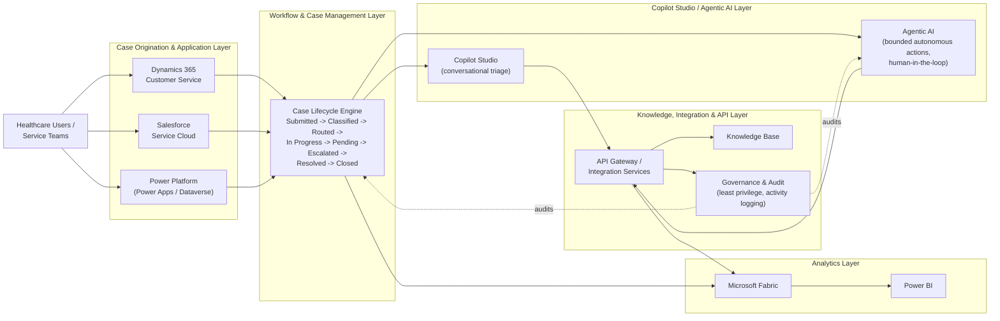

# Healthcare Agentic Service Operations Platform

> **Portfolio project.** A synthetic, architecture-first demonstration of enterprise
> business solution design for healthcare-style service operations. It is **not**
> connected to any real NHS system, does not process real patient data, and does not
> run against a live Dynamics 365 or Salesforce tenant. See the
> [Portfolio & Simulation Disclaimer](#10-portfolio--simulation-disclaimer) below.

**Status:** Milestone 1 — Repository Foundation (see [§9](#9-current-implementation-status)).

---

## Table of Contents

1. [Business Problem](#1-business-problem)
2. [Synthetic Healthcare Scenario](#2-synthetic-healthcare-scenario)
3. [Target Capabilities](#3-target-capabilities)
4. [High-Level Solution Architecture](#4-high-level-solution-architecture)
5. [Technology Landscape](#5-technology-landscape)
6. [Repository Structure](#6-repository-structure)
7. [Delivery Roadmap](#7-delivery-roadmap)
8. [Governance & Responsible AI Principles](#8-governance--responsible-ai-principles)
9. [Current Implementation Status](#9-current-implementation-status)
10. [Portfolio & Simulation Disclaimer](#10-portfolio--simulation-disclaimer)

---

## 1. Business Problem

Large healthcare provider organisations run internal service operations — digital
support, clinical equipment logistics, facilities requests, access and identity
management, application support, and data/reporting requests — across a mix of
case-management platforms (e.g. Dynamics 365 Customer Service, Salesforce Service
Cloud), low-code automation (Power Platform), and, increasingly, conversational and
agentic AI (Copilot Studio, autonomous agents).

This creates recurring architectural challenges:

- **Platform fragmentation** — service teams and case data are split across CRM
  platforms with inconsistent process models.
- **Inconsistent case handling** — classification, routing, and escalation logic is
  often duplicated or platform-specific rather than defined once as a business
  process.
- **Unclear AI accountability** — as agentic AI is introduced into service
  operations, organisations need a clear model of what is deterministic automation
  versus autonomous agent behaviour, and where a human must stay in the loop.
- **Weak evidence trails** — audit, governance, and reporting are frequently
  bolted on rather than designed in from the start.
- **Vendor lock-in risk** — business logic embedded directly in a single SaaS
  platform is expensive to port or replace.

This repository demonstrates how these problems can be addressed through
platform-neutral business process design, API-first integration, and governed
agentic AI — using a synthetic healthcare scenario as the worked example.

## 2. Synthetic Healthcare Scenario

All scenario content in this repository is **fictional and synthetic**, styled on
an NHS-like service operations context for realism, but containing no real
organisational, patient, or operational data.

The scenario: a fictional healthcare provider trust runs an internal service desk
that handles requests from clinical and non-clinical staff across six synthetic
service categories:

- **Digital Support** — laptops, accounts, collaboration tools
- **Clinical Equipment** — requests, faults, and logistics for non-patient-identifying
  clinical equipment
- **Facilities** — estates, environment, and physical workplace requests
- **Access and Identity** — role-based access requests, joiners/movers/leavers
- **Application Support** — line-of-business application incidents and requests
- **Data and Reporting** — internal reporting and analytics requests

Every request (a "case") conceptually moves through the same lifecycle regardless of
which platform originates or handles it:

```
Submitted → Classified → Routed → In Progress → Pending → Escalated → Resolved → Closed
```

This lifecycle and taxonomy are defined once, platform-neutrally, in
[`business_process/`](business_process/), so that Dynamics 365, Salesforce, and any
future channel implement the *same* business process rather than inventing their own.

## 3. Target Capabilities

The platform is designed (across all milestones, not all built yet — see
[§7](#7-delivery-roadmap)) to demonstrate:

- A platform-neutral case/service-request process model and taxonomy
- Reference case-management patterns on **Dynamics 365 Customer Service** and
  **Salesforce Service Cloud** as interchangeable, bounded application contexts
- **Power Platform** automation patterns (Power Automate flow design, Dataverse
  modelling) for deterministic workflow steps
- **Copilot Studio** and agentic AI patterns for triage, knowledge assistance, and
  bounded autonomous actions, with explicit human-in-the-loop checkpoints
- **API-first integration** between case-management systems, automation, and AI
  agents, avoiding direct point-to-point coupling
- **Fabric / Power BI** analytics over synthetic case data for operational
  reporting and evidence
- **Governance tooling** — audit logging patterns, least-privilege access design,
  and responsible-AI guardrails
- **CI/CD and engineering baseline** — linting, static analysis, and automated
  tests supporting the above as real, runnable code (not just diagrams)

## 4. High-Level Solution Architecture



**Reading the diagram:** healthcare users interact with case-management platforms
(Dynamics 365, Salesforce, Power Platform), which all feed a single, platform-neutral
case lifecycle. Copilot Studio and agentic AI sit alongside that lifecycle — never
replacing it — and reach the rest of the estate only through an API/integration
layer, which is also where governance and audit controls are enforced. Analytics
(Fabric / Power BI) consumes case and integration data for reporting, independent of
which front-end CRM originated the case.

See [`docs/architecture.md`](docs/architecture.md) for the full set of architecture
principles and their rationale.

## 5. Technology Landscape

| Layer                     | Representative Technology                          | Role in this repository (Milestone 1) |
|---------------------------|------------------------------------------------------|----------------------------------------|
| CRM / Case Management     | Dynamics 365 Customer Service, Salesforce Service Cloud | Bounded contexts with placeholder docs; no live tenants |
| Low-code Automation       | Power Platform (Power Apps, Power Automate, Dataverse) | Bounded context with placeholder docs |
| Conversational / Agentic AI | Copilot Studio, agentic AI patterns                 | Bounded context with placeholder docs |
| Integration                | API-first services, event/message patterns          | Bounded context with placeholder docs |
| Analytics                  | Microsoft Fabric, Power BI                           | Bounded context with placeholder docs |
| Business Process           | Platform-neutral Python domain model                | **Implemented** — taxonomy & lifecycle types |
| Governance                 | Audit/access design patterns                         | Bounded context with placeholder docs |
| Engineering Baseline       | Python 3.11+, pytest, ruff, mypy, Docker, GitHub Actions | **Implemented** |

Dependencies are kept deliberately minimal for this milestone — see
[`requirements.txt`](requirements.txt) and [`pyproject.toml`](pyproject.toml).
Platform-specific SDKs are intentionally **not** installed until a milestone
actually implements against them, to avoid implying integrations that do not
exist yet.

## 6. Repository Structure

```
healthcare-agentic-service-operations-platform/
├── business_process/     # Platform-neutral process model (taxonomy, lifecycle) — implemented
├── dynamics365/           # Dynamics 365 Customer Service bounded context — placeholder
├── salesforce/            # Salesforce Service Cloud bounded context — placeholder
├── power_platform/        # Power Platform (Power Apps/Automate/Dataverse) — placeholder
├── copilot/                # Copilot Studio conversational AI — placeholder
├── ai/                      # Agentic AI patterns and guardrails — placeholder
├── analytics/              # Fabric / Power BI analytics — placeholder
├── integrations/           # API-first integration layer — placeholder
├── governance/             # Audit, access, and responsible-AI controls — placeholder
├── data/                    # Synthetic data only — no real patient/organisational data
├── outputs/                 # Generated artefacts (git-ignored contents)
├── reports/                 # Generated reports (git-ignored contents)
├── docs/                    # Extended architecture, governance, and roadmap docs
├── tests/                   # Automated tests
├── .github/workflows/       # CI pipeline
├── Dockerfile
├── pyproject.toml
├── requirements.txt
└── README.md
```

Each placeholder domain contains a short `README.md` explaining its intended scope
and current (unimplemented) status — no fabricated connectors, credentials, or SaaS
assets are included.

## 7. Delivery Roadmap

| Milestone | Scope | Status |
|-----------|-------|--------|
| 1 | Repository foundation: architecture, structure, engineering baseline, CI | **This milestone** |
| 2 | Platform-neutral business process implementation (case model, taxonomy, lifecycle rules, synthetic data) | Planned |
| 3 | Dynamics 365 and Salesforce bounded-context reference implementations (design artefacts / metadata, not live tenants) | Planned |
| 4 | Power Platform automation patterns (Power Automate flow designs, Dataverse schema) | Planned |
| 5 | Copilot Studio & agentic AI patterns with human-in-the-loop controls | Planned |
| 6 | Integration layer (API-first service contracts) | Planned |
| 7 | Fabric / Power BI analytics over synthetic case data | Planned |
| 8 | Governance, audit trail, and responsible-AI controls hardening | Planned |

Milestone scope, sequencing, and detail may evolve as the portfolio project
progresses. See [`docs/roadmap.md`](docs/roadmap.md) for more detail.

## 8. Governance & Responsible AI Principles

These principles apply across every milestone of this repository:

- **Platform-neutral business-process design** — the case lifecycle and taxonomy are
  defined independently of any single CRM/SaaS platform.
- **Dynamics 365 and Salesforce as bounded application contexts** — each platform is
  treated as a replaceable implementation detail, not the source of truth for
  business process.
- **API-first integration** — systems integrate through defined APIs/contracts, not
  direct database or UI-layer coupling.
- **Loose coupling** — components are designed to be replaced independently.
- **Human-in-the-loop controls** — any agentic AI action with real-world effect has
  a defined human checkpoint.
- **Deterministic automation vs. autonomous agent behaviour** — Power Automate-style
  deterministic workflow steps are explicitly distinguished from agentic AI
  decisions in design and documentation.
- **Least privilege** — every integration and agent is designed against the minimum
  access it needs, not broad/admin access.
- **Auditable agent activity** — agentic AI actions are designed to be logged and
  reviewable, not opaque.
- **Synthetic data only** — no real patient, staff, or organisational data is used
  anywhere in this repository.
- **Portable analytics/evidence** — analytics and reporting artefacts are designed to
  be exportable and platform-independent, not locked to one BI tool.
- **Modular, replaceable SaaS components** — every platform-specific area is
  designed so it could be swapped for an equivalent product without changing the
  core business process.

See [`docs/governance.md`](docs/governance.md) for extended rationale.

## 9. Current Implementation Status

**Milestone 1 (this milestone) delivers repository foundation only:**

- ✅ Repository structure and bounded-context placeholders for every target domain
- ✅ Platform-neutral service taxonomy and case lifecycle **types** (no workflow
  engine, state transitions, or persistence yet)
- ✅ Engineering baseline: `pyproject.toml`, `requirements.txt`, `.gitignore`,
  `Dockerfile`, GitHub Actions CI (lint, type-check, test)
- ✅ Initial automated tests validating the taxonomy/lifecycle types and repository
  structure
- ❌ No Dynamics 365, Salesforce, Power Platform, or Copilot Studio integration code
- ❌ No agentic AI implementation
- ❌ No Fabric/Power BI analytics implementation
- ❌ No workflow/state-machine implementation for the case lifecycle
- ❌ No synthetic data generation yet
- ❌ No deployment of any kind

## 10. Portfolio & Simulation Disclaimer

This repository is an **independent portfolio project** built to demonstrate
enterprise business solution architecture skills. It is **not**:

- affiliated with, endorsed by, or built for the NHS or any NHS organisation;
- connected to any real Dynamics 365, Salesforce, Power Platform, or Copilot Studio
  tenant;
- processing, storing, or referencing real patient, clinical, or staff data;
- evidence of a production deployment, live customer delivery, or client
  engagement.

All organisation names, scenarios, service categories, and data referenced in this
repository are **fictional and synthetic**, created solely to illustrate
architecture and engineering practice. Any resemblance to real systems, datasets, or
deployments is coincidental.
