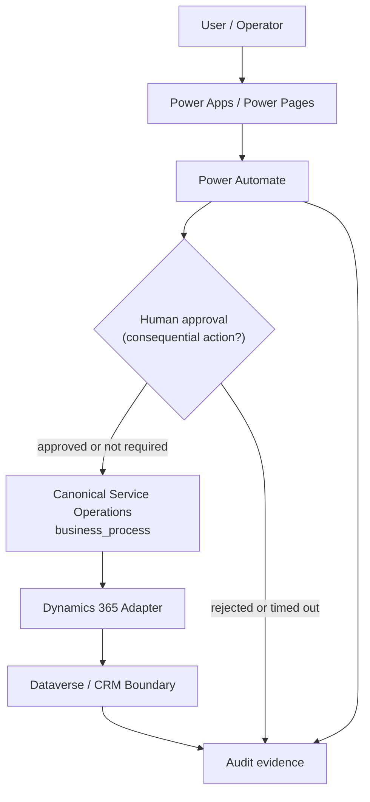

# Architecture

This document expands on the architecture summary in the
[root README](../README.md#4-high-level-solution-architecture). It is a
portfolio/simulation artefact — see the
[disclaimer](../README.md#10-portfolio--simulation-disclaimer).

## Architecture Principles

**Platform-neutral business-process design**
The case taxonomy, lifecycle, priority, routing, SLA, and escalation rules
are defined once, in [`business_process/`](../business_process/), as plain
Python types and pure functions with no dependency on any CRM SDK. Every
platform bounded context implements *against* this model rather than each
defining its own. See [`docs/business_process.md`](business_process.md) for
the full model and its diagrams.

**Dynamics 365 and Salesforce as bounded application contexts**
Each CRM is treated as an interchangeable implementation detail for case
origination and agent-facing UI — not as the system of record for business
process logic. A design should be able to describe "how would this look on
the other platform?" without changing the process model. As of Milestone 3
this is implemented, not just described: [`dynamics365/`](../dynamics365/)
and [`salesforce/`](../salesforce/) are pure, deterministic reference
adapters over the same canonical model — see
[`docs/business_process.md`](business_process.md) §7 and
[`docs/crm_schema_mapping.md`](crm_schema_mapping.md) for the field-by-field
mapping and its boundary enforcement (`tests/test_adapter_boundary.py`).

**API-first integration**
Cross-system communication goes through [`integrations/`](../integrations/)
service contracts, never direct database or UI-layer coupling between two
platforms. [`integrations/envelope.py`](../integrations/envelope.py) defines
the lightweight `IntegrationEnvelope` contract (source system, source record
id, canonical case id, correlation id, schema version, timestamp, operation)
that a payload travels with; [`integrations/examples.py`](../integrations/examples.py)
shows where a future live connector would sit — no transport or message
broker is implemented yet.

As of Milestone 4, [`power_platform/connectors/`](../power_platform/connectors/)
adds the intended custom-connector/API boundary for Power Platform
orchestration. It references canonical operations such as `create_case`,
`transition_case`, `evaluate_sla`, `evaluate_escalation`, and `resolve_case`
without building a live endpoint or custom connector.

**Loose coupling**
Every bounded context is designed to be replaced independently — e.g.
swapping Dynamics 365 for Salesforce, or one analytics tool for another,
should not require rewriting the business process model.

**Human-in-the-loop controls**
Any agentic AI action with a real-world effect (state change, notification,
escalation) has a defined human approval checkpoint before it takes effect,
tracked through [`governance/`](../governance/).

Milestone 4 applies the same principle to deterministic automation for
consequential non-clinical actions: the Power Automate approval pattern
records requester, approver role, decision, reason, timestamps, correlation
id, audit result, and timeout outcome before any approved downstream action
continues.

**Deterministic automation vs. autonomous agent behaviour**
[`power_platform/`](../power_platform/) (Power Automate-style flows) is
explicitly deterministic: fixed rules, fixed outcomes. [`ai/`](../ai/) and
[`copilot/`](../copilot/) are explicitly agentic: model-driven decisions with
bounded scope. Documentation and design artefacts must make clear which
category any given step falls into.

As of Milestone 4, the deterministic automation side is implemented as
reference specifications only: Power Automate JSON specs, Power Apps and
Power Pages architecture documents, connector contracts, approval examples,
and synthetic automation evidence. There are no live Power Platform flows,
Dataverse calls, exported solutions, Copilot Studio assets, LLM calls, or
autonomous agents.

**Least privilege**
Every integration credential and agent capability is scoped to the minimum
access required for its task, never broad/admin-level access.

**Auditable agent activity**
Every autonomous agent action is designed to be logged in a form that
[`governance/`](../governance/) can review — who/what triggered it, what it
did, and what human checkpoint (if any) approved it.

**Synthetic data only**
No real patient, clinical, staff, or organisational data is used anywhere in
this repository — see [`data/README.md`](../data/README.md).

**Portable analytics/evidence**
[`analytics/`](../analytics/) artefacts are designed to be exportable
(e.g. to files under [`reports/`](../reports/)) rather than living only inside
one BI tool's proprietary format.

**Modular, replaceable SaaS components**
Each platform-specific directory is a bounded context behind a stable
conceptual interface (the case lifecycle) so it can, in principle, be swapped
for an equivalent product.

## Power Platform Orchestration Diagram

The important direction is one-way for business decisions:
Power Platform orchestrates interaction, approval, notification, and evidence;
[`business_process/`](../business_process/) decides lifecycle validity,
priority, routing, SLA status, and escalation; [`dynamics365/`](../dynamics365/)
translates the resulting canonical state for the Dataverse/CRM boundary.

## High-Level Diagram

See the [architecture diagram](../README.md#4-high-level-solution-architecture)
in the root README for the current high-level view: healthcare users/service
teams → Dynamics 365 / Salesforce / Power Platform → workflow and
case-management layer → Copilot Studio / agentic AI → knowledge, integrations
and APIs → Fabric / Power BI analytics, with governance/audit observing the
agentic and case-management layers throughout.

This diagram will gain detail (data flows, specific API contracts, deployment
topology) as later milestones implement the bounded contexts it currently
shows only conceptually.
