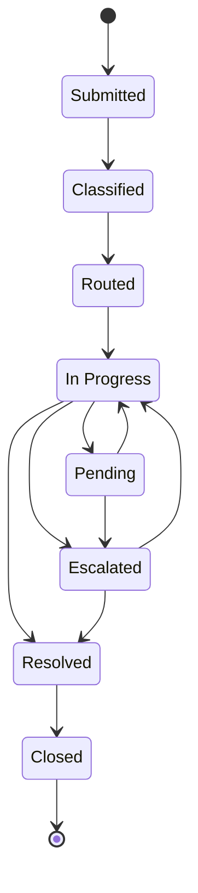
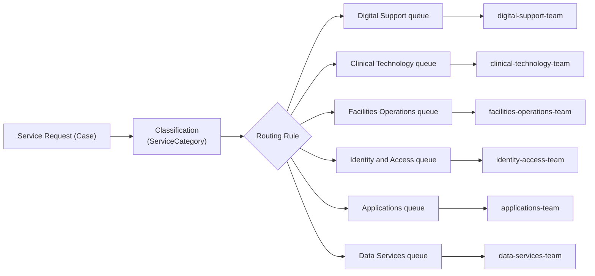

# Business Process & Service Operating Model

This document is the detailed reference for the canonical, platform-neutral
service operations domain implemented in [`business_process/`](../business_process/)
(Milestone 2). It expands on the summary in the
[root README](../README.md#2-synthetic-healthcare-scenario). See the
[Portfolio & Simulation Disclaimer](../README.md#10-portfolio--simulation-disclaimer) —
everything below describes a synthetic scenario and a code-level domain
model, not a live service desk.

## 1. Service Operating Model

The domain models one thing: a **service request ("case")** raised by
healthcare staff against one of six synthetic service categories, handled by
a queue-based team, subject to a priority-driven SLA, and tracked through a
fixed lifecycle with a full audit trail.

```
Service Category × Priority  ─┬─►  SLA target (response / resolution)
                               │
Case  ──►  Classification  ──►  Routing  ──►  Queue  ──►  Owner (team)
  │
  └──►  Lifecycle stage (Submitted → ... → Closed), each move audited
```

The implementation is deliberately small: plain Python dataclasses and enums
(`business_process/models.py`, `taxonomy.py`, `priority.py`, `queues.py`)
plus a handful of pure functions (`lifecycle.py`, `sla.py`, `escalation.py`,
`service.py`) that operate on them. There is no database, no scheduler, and
no persistence layer — this milestone models the *business rules*, not a
running system.

## 2. Case Lifecycle

The eight-stage lifecycle from Milestone 1 is now backed by explicit,
enforced transition rules (`business_process/lifecycle.py`). An invalid move
raises `InvalidLifecycleTransitionError` rather than silently succeeding.



`Closed` is terminal — no transition leaves it in this milestone (no
reopen-after-close flow is modelled yet). Every transition, plus case
creation, appends an immutable `CaseEvent` to the case's `history`, forming
its audit trail (see [§6](#6-roles--responsibilities) and
[`docs/governance.md`](governance.md)).

## 3. Queue and Routing Model

Routing is a fixed, deterministic lookup — one service category maps to
exactly one queue, and one queue has exactly one default owning team
(`business_process/queues.py`). There is no AI-assisted triage in this
milestone; that is explicitly deferred (see [§7](#7-canonical-domain--future-platform-adapters)
and [`docs/roadmap.md`](roadmap.md)).



`business_process.service.classify_and_route()` performs the
`Submitted -> Classified -> Routed` moves in one step and stamps the case's
`queue` and `owner` fields.

## 4. SLA Model

Each case's SLA target is a function of its priority and service category
(`business_process/sla.py`):

- **Base targets** (response/resolution minutes) are set per `Priority`
  (Low/Medium/High/Critical) — more urgent priorities get tighter targets.
- **A per-category resolution multiplier** adjusts the resolution target
  only — e.g. Clinical Equipment is tightened (0.5×) to reflect
  safety-adjacent equipment, Data and Reporting is loosened (1.5×) as the
  least time-critical category. Response targets are not category-adjusted.
- `evaluate_sla()` compares a case's actual timestamps (or "now", if still
  open) against its target and reports `response_breached` /
  `resolution_breached` booleans plus the due timestamps.

This is a simple, illustrative configuration for demonstrating the concept —
explicitly **not** an attempt to reproduce Dynamics 365 entitlements or
Salesforce Service Cloud's SLA/Entitlement engine. The full generated matrix
is in [`data/synthetic/sla_config.json`](../data/synthetic/sla_config.json).

## 5. Escalation Model

`business_process/escalation.py` decides *whether* a case qualifies for
escalation — it does not perform the escalation itself (that is
`business_process.service.escalate_case()`, an explicit, human/service-agent
initiated call). Checked in order of severity:

1. **SLA resolution breach** — the resolution target has passed.
2. **SLA response breach** — the response target has passed (and resolution
   has not yet also breached).
3. **Critical priority left pending** — a `Critical` case sitting in
   `Pending` qualifies even before any SLA target is breached.

This is a deterministic rule set, not an autonomous agent decision. Whether
an agent may call `should_escalate()` unsupervised in a later milestone is a
governance question — see [`docs/governance.md`](governance.md).

## 6. Roles & Responsibilities

| Role | Responsibility in this model |
|------|-------------------------------|
| Requestor | Raises a case (`create_case`); recorded as the `actor` on the `created` event. Not a named individual — a role. |
| Intake | Classifies and routes the case (`classify_and_route`); in this milestone this is a deterministic function, not a person or an AI agent. |
| Queue owner (team) | The default owning team for a case's queue (`assign_owner`); performs `start_work`, `mark_pending`, `resolve_case`, `close_case`. Modelled as a team identifier, never a named person. |
| (Future) Governance/audit reviewer | Reviews the `CaseEvent` history for a case. Not implemented — see [`governance/README.md`](../governance/README.md). |
| (Future) Agentic AI | Would call `should_escalate()` / classification logic under human-in-the-loop review. Not implemented — see [`ai/README.md`](../ai/README.md). |

No named individuals, patients, or real staff appear anywhere in this model
or its fixtures — see [`business_process/fixtures.py`](../business_process/fixtures.py)
and its tests.

## 7. Canonical Domain → Future Platform Adapters

**Principle:** `canonical service operations domain → platform adapters`.

Everything in `business_process/` — `ServiceCategory`, `CaseStage`,
`Priority`, `Queue`, `Case`, `CaseEvent`, `SLATarget`, `EscalationReason` — is
the single source of truth for what a case *is* and how it behaves. It has
no dependency on, or knowledge of, Dynamics 365 or Salesforce.

When Milestone 3 introduces Dynamics 365 and Salesforce bounded contexts,
the expected shape is an **adapter**, in each platform's own directory, that:

- maps `Case`/`CaseEvent` onto that platform's entities (Dataverse
  tables for Dynamics 365, standard/custom objects for Salesforce Service
  Cloud);
- translates the platform's native events into calls against
  `business_process.service` functions (or a thin API in front of them),
  never re-implementing lifecycle, routing, or SLA rules independently;
- can be replaced by the *other* platform's adapter without changing
  anything in `business_process/`.

Concretely, this means:

- Dynamics 365 and Salesforce **consume** this model; they do not **define**
  it.
- No lifecycle, SLA, routing, or escalation rule may live only inside a
  platform-specific directory — if it needs to hold true regardless of
  platform, it belongs in `business_process/`.
- Platform-specific concerns (form layouts, security roles, connector
  authentication, platform-native automation) stay entirely inside their own
  bounded context.

This boundary is what allows Milestone 3 to build *both* a Dynamics 365 and
a Salesforce reference mapping onto the *same* underlying model, demonstrating
platform-neutral architecture rather than a Dynamics-shaped or
Salesforce-shaped domain model in disguise.
